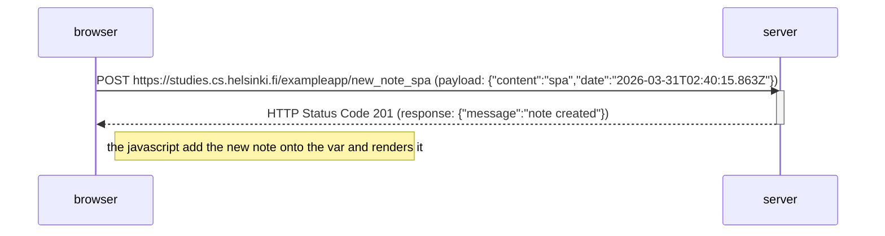

```mermaid
sequenceDiagram
    participant browser
    participant server

    browser->>server: POST https://studies.cs.helsinki.fi/exampleapp/new_note_spa (payload: {"content":"spa","date":"2026-03-31T02:40:15.863Z"})
    activate server
    server-->>browser: HTTP Status Code 201 (response: {"message":"note created"})
    deactivate server

    Note right of browser: the javascript add the new note onto the var and renders it
```